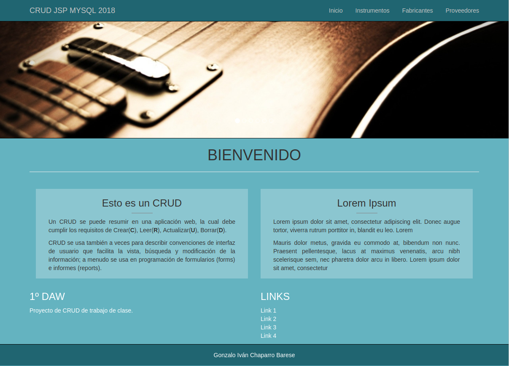
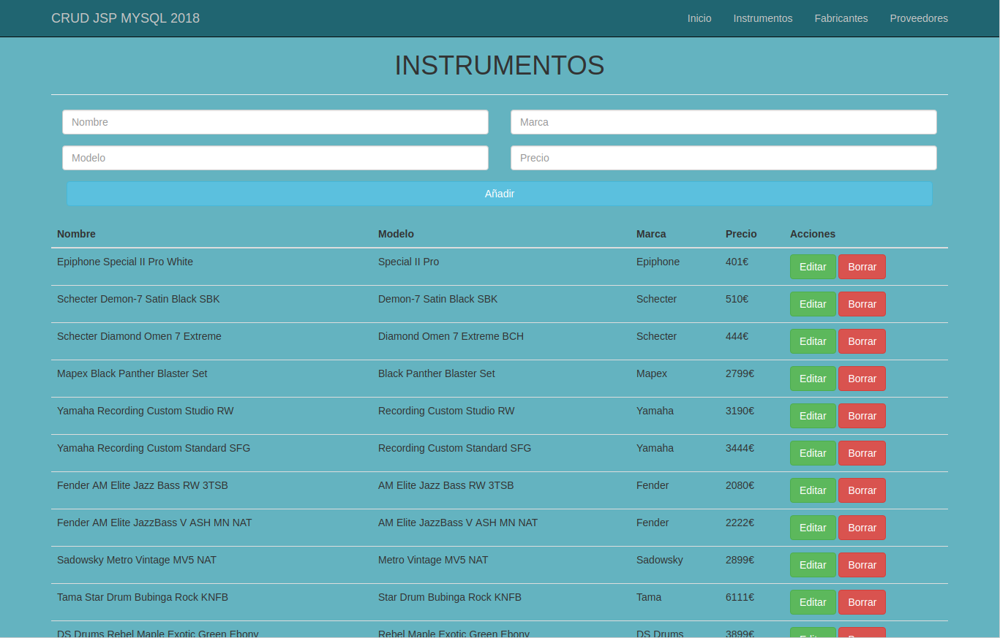
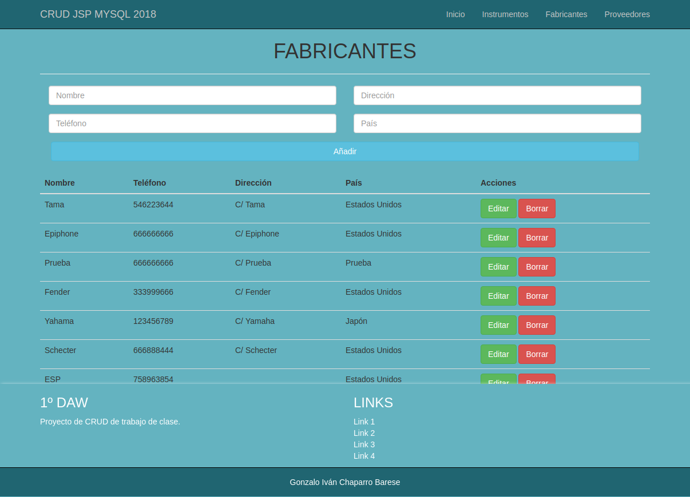
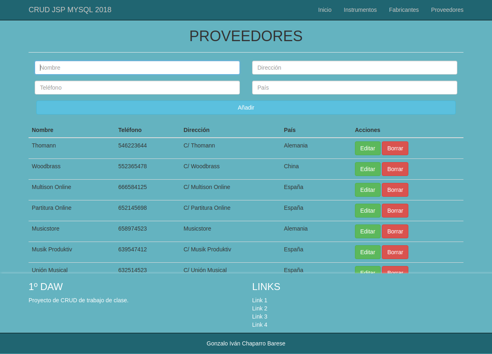
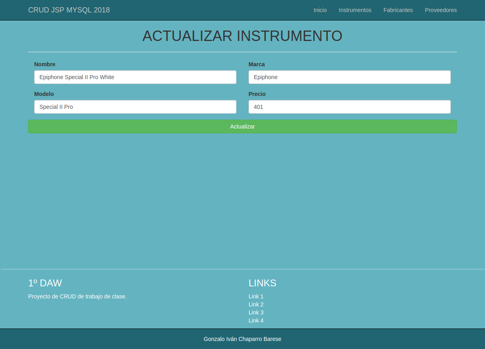

# CRUD_JSP_2018

Este ejercicio en JSP y MySQL será sobre una tienda de música (Guitarras, Bajos y Baterías).  


## Descripción

He usado el framework CSS Bootstrap que ha dado estilo a la web basada en JSP y base de datos en MySQL.
He decidido hacerlo sobre música porque es lo que más me gusta.  


## Páginas

Aquí dejo capturas de pantalla de las diferentes páginas de la web.  


### Inicio



Decidí usar unos colores estilo Material Design.  


### Instrumentos

  


### Fabricantes

  


### Proveedores

  


## Funcionalidades

```
Ahora vamos a ver las funcionalidades
```


### Editar / Actualizar

  


### Borrar / Añadir / Mostrar

  
